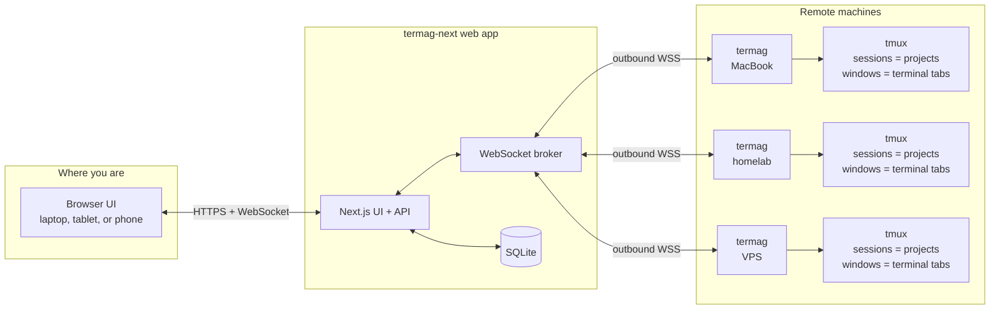
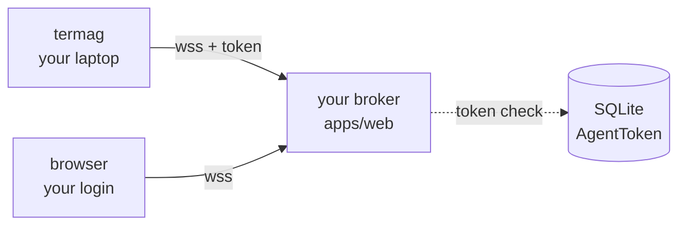

# termag-next

termag-next is a browser-based tmux workspace for coding agents on remote machines.

It is a Next.js fork and rebuild of the original [termag](https://github.com/yeutterg/termag) project. The idea is simple: run one web app somewhere reachable, run a small outbound agent on each machine that has projects, then use one browser to open the tmux sessions from all of those machines.

That browser can be on your laptop, a tablet, or a phone on a cellular connection. Your real work still happens inside tmux on the remote device, but the UI follows you.


## How It Works



The agent always dials out to the web app. You do not need to expose tmux, SSH, or a laptop port to the internet.

## Components

- `apps/web`: the Next.js app. It includes the browser UI, route handlers, WebSocket broker, Prisma, and SQLite database.
- `apps/agent`: the small daemon that runs beside tmux on each remote device and bridges a PTY-backed tmux client back to the browser.
- `infra`: Docker Compose and Caddy files for running the web app on a small VPS.

The user-facing shape is:

- Device: a machine running `termag`. Create one device token per machine.
- Project: a tmux session on that device. A new project creates a Termag-managed tmux session; attaching an existing tmux session imports it as a project.
- Terminal tab: one tmux window inside that project/session, running Claude Code, Codex, a YOLO variant, another CLI command, or an existing tmux window.
- Ctrl shell: a regular tmux window for git, tests, and quick commands in Termag-managed projects.

## Security Model

There is no shared termag-next service. Each user runs their own broker, and agents only ever talk to it.



Three things tie your agents to your broker:

1. **`TERMAG_URL` is on your laptop.** The agent only ever talks to the URL you set. Random brokers don't know your laptop exists.
2. **The agent token is minted by your broker.** It's stored hashed in your broker's SQLite. The agent presents the raw value on connect; if the hash isn't in the table, the connection is rejected.
3. **The agent rejects bare `ws://` for non-localhost.** Even if DNS got poisoned to point your `TERMAG_URL` somewhere hostile, the token can't leak in plaintext. The agent fails closed unless the URL is `wss://` or localhost.

Trust boundary: the device holding `TERMAG_AGENT_TOKEN` can connect; the broker that minted the token is what it connects to; the browser logged in to that broker sees the sessions. Three things, all yours.

## Quick Setup

### 1. Run The Web App

Pick the path that matches how the broker will be reached. Both use Docker Compose; only the env vars differ. Agent connections are unaffected by either choice — they always require a bearer token minted in the web UI.

#### Path A — Private network (Tailscale, WireGuard, ssh tunnel, LAN)

Opt-in mode. Set `TERMAG_TRUSTED_NETWORK=true` to skip the login screen entirely — anyone who can reach the URL gets a session, which is exactly what you want when the URL is already gated by your VPN. The broker refuses to boot in trusted-network mode with a non-loopback bind unless you also set `TERMAG_PASSWORD` (or front it behind a tunnel that binds to `127.0.0.1`).

Clone, then prep your env file:

```bash
git clone https://github.com/yeutterg/termag-next.git
cd termag-next
cp infra/.env.example infra/.env
```

Generate the NextAuth secret (NextAuth needs one even when there's no login screen):

```bash
openssl rand -hex 32
```

Edit `infra/.env`. Pick the shape that matches where the broker will actually live:

```bash
# Local testing on your own machine:
TERMAG_HOST=localhost
NEXTAUTH_URL=http://localhost

# Or — Tailscale / WireGuard / LAN:
# TERMAG_HOST=termag.tailnet
# NEXTAUTH_URL=https://termag.tailnet

NEXTAUTH_SECRET=<paste output of openssl above>
TERMAG_ROOTS={"<device-name>":"<project-root>"}
TERMAG_TRUSTED_NETWORK=true
# If the broker is bound to anything other than 127.0.0.1, also set:
# TERMAG_PASSWORD=pick-a-long-random-string
```

`NEXTAUTH_URL` must be exactly what the browser types — same scheme, host, and port. A mismatch breaks OAuth callbacks and session cookies.

Start the stack:

```bash
cd infra
docker compose up -d --build
```

Open the URL you set in `NEXTAUTH_URL` — you're in. With the local Docker stack, Caddy publishes the app on host ports `80` and `443`; the Next.js container's port `3000` stays internal to Docker. `http://localhost` redirects to `https://localhost`, and Safari may show a "not private" warning for that local Caddy certificate.

**Optional shared-password gate** as a thin "oops I leaked the URL" safety net (useful for a homelab but NOT a substitute for OAuth on the open internet):

```bash
# add to infra/.env
TERMAG_PASSWORD=pick-a-long-random-string
```

#### Path B — Public hostname (Google OAuth)

Use this when the broker is reachable over the open internet. Adds a Google login with a single-email allowlist.

First create OAuth credentials at https://console.cloud.google.com/apis/credentials → **Create OAuth Client ID** → **Web application**, with authorized redirect URI `https://termag.example.com/api/auth/callback/google`.

Clone and prep:

```bash
git clone https://github.com/yeutterg/termag-next.git
cd termag-next
cp infra/.env.example infra/.env
openssl rand -hex 32
```

Edit `infra/.env`:

```bash
TERMAG_HOST=termag.example.com
NEXTAUTH_URL=https://termag.example.com
NEXTAUTH_SECRET=<paste output of openssl above>
TERMAG_ROOTS={"<device-name>":"<project-root>"}

TERMAG_TRUSTED_NETWORK=false
GOOGLE_CLIENT_ID=...
GOOGLE_CLIENT_SECRET=...
TERMAG_ALLOWED_EMAIL=you@example.com    # only this address gets past signIn
```

Start the stack:

```bash
cd infra
docker compose up -d --build
```

Caddy auto-issues a Let's Encrypt cert for `TERMAG_HOST`. Open `https://termag.example.com` and sign in with Google.

Put these variables in `infra/.env` for Docker Compose, or in `apps/web/.env.local` for local development.

### 2. Create One Token Per Device

In the web UI, click `+` → **New Device**. Name the physical device, for example `laptop`, `workstation`, `vps`, or `homelab`, then create the token. The raw token is shown once and includes a copy button.

### 3. Install An Agent On Each Device

The agent needs Node.js and tmux. Homebrew is preferred on macOS:

```bash
brew install yeutterg/tap/termag-agent
```

npm works anywhere Node.js and tmux are available:

```bash
npm install -g termag-agent
```

Configure the agent:

```bash
export TERMAG_URL=wss://termag.example.com/api/ws/agent
export TERMAG_AGENT_TOKEN=tmag_...
export TERMAG_AGENT_ROOTS='{"<device-name>":"<project-root>"}'
```

Use your broker URL for `TERMAG_URL`; examples are below. The key in `TERMAG_AGENT_ROOTS` must match the device name you created in the web UI. If the UI device is `workstation`, use:

```bash
export TERMAG_AGENT_ROOTS='{"workstation":"~/Projects"}'
```

Run it:

```bash
termag
```

When testing an unreleased checkout of termag-next, run the agent from this repo instead of a globally installed Homebrew/npm copy:

```bash
npm run agent
```

`TERMAG_URL` always includes the port unless you're using a default-port reverse proxy. Common shapes:

```bash
# Public hostname behind Caddy/nginx on TLS (no explicit port — 443 implied):
TERMAG_URL=wss://termag.example.com/api/ws/agent

# Tailscale or LAN with TLS terminator on port 443:
TERMAG_URL=wss://termag.tailnet/api/ws/agent

# Local development against `npm run dev` (default port 3000):
TERMAG_URL=ws://localhost:3000/api/ws/agent

# Local Docker stack with Caddy on port 443:
TERMAG_URL=wss://localhost/api/ws/agent
```

`ws://` (no TLS) is only accepted when the hostname is `localhost`, `127.0.0.1`, or `::1`. Anything else must be `wss://` or the agent refuses to connect.

If you are using the local Docker stack at `wss://localhost`, Caddy serves a local certificate that Node may not trust. For that local-only case, add:

```bash
export TERMAG_TLS_INSECURE_SKIP_VERIFY=true
```

Do not use that setting for public or remote hosts.

A complete local Docker agent config looks like:

```bash
export TERMAG_URL=wss://localhost/api/ws/agent
export TERMAG_AGENT_TOKEN=tmag_...
export TERMAG_AGENT_ROOTS='{"workstation":"~/Projects"}'
export TERMAG_TLS_INSECURE_SKIP_VERIFY=true
```

Add more devices by creating one token per device, installing the agent on that device, and giving it a named root. The root key is the device label in the sidebar.

### 4. Create Or Attach Sessions

Click `+` -> **New session**. Select the device, enter the project directory, then choose the command to start. **Shell** is the lowest-friction default; add Codex, Claude Code, or any other command when you want an agent tab.

Sessions map to tmux sessions. Each terminal tab maps to a tmux window in the same session, so the same workspace can still be inspected or recovered with native tmux.

To bind Termag to work you already have running, click `+` -> **Connect tmux session**. The dialog lists unattached tmux sessions from every connected device. Pick a session and Termag adds one terminal tab for each tmux window. Existing attached windows are treated as external: deleting the Termag project detaches from them instead of killing the tmux session. New tabs you add later inside that attached project are Termag-created tmux windows in the same session.

You can also publish from the device itself:

```bash
termag new            # fresh tmux-backed shell here
termag connect        # publish this tmux window, or create one if outside tmux
termag adopt          # publish every window in the current tmux session
# explicit project/tab override:
termag connect --project Restful-ESP32 --tab codex
# equivalent shorthand:
termag -p Restful-ESP32 -t codex
```

With no flags, `new` and `connect` infer the project from the current git repo or directory name. That creates or updates the project in the browser and adds the current tmux window as a terminal tab. To publish every window in the current tmux session:

```bash
termag adopt Restful-ESP32
```

These commands use the same `TERMAG_URL` and `TERMAG_AGENT_TOKEN` exports as the long-running agent. If a command runs outside tmux, Termag creates or reuses a detached tmux session named after the project and a window named after `--tab`, starts the background websocket agent, then attaches your local terminal to the tmux session. A normal Terminal or iTerm shell cannot be moved into tmux after it has already started, so this fallback starts a new shell at the current directory. Use `--no-attach` to publish without attaching locally, or `--no-agent` if you already manage the long-running agent separately.

## Local Development

For working on termag-next itself:

```bash
npm install
cp .env.example apps/web/.env.local
npm run db:generate
npm run db:migrate
npm run dev
```

Configure a local agent in another shell:

```bash
export TERMAG_URL=ws://localhost:3000/api/ws/agent
export TERMAG_AGENT_TOKEN=tmag_...
export TERMAG_AGENT_ROOTS='{"local":"~/Projects"}'
```

Run it:

```bash
npm run agent
```

Preview the UI without tmux:

```bash
export TERMAG_PREVIEW_AGENT_TOKEN="tmag_$(openssl rand -hex 32)"
DATABASE_URL='file:./dev.db' npm run preview:seed -w apps/web
npm run dev
```

Then configure the fake agent in another shell:

```bash
export TERMAG_URL='ws://localhost:3000/api/ws/agent'
export TERMAG_AGENT_TOKEN="$TERMAG_PREVIEW_AGENT_TOKEN"
```

Run it:

```bash
npm run fake -w apps/agent
```

## Useful Commands

```bash
npm run typecheck
npm run build
npm run dev
npm run agent
```
