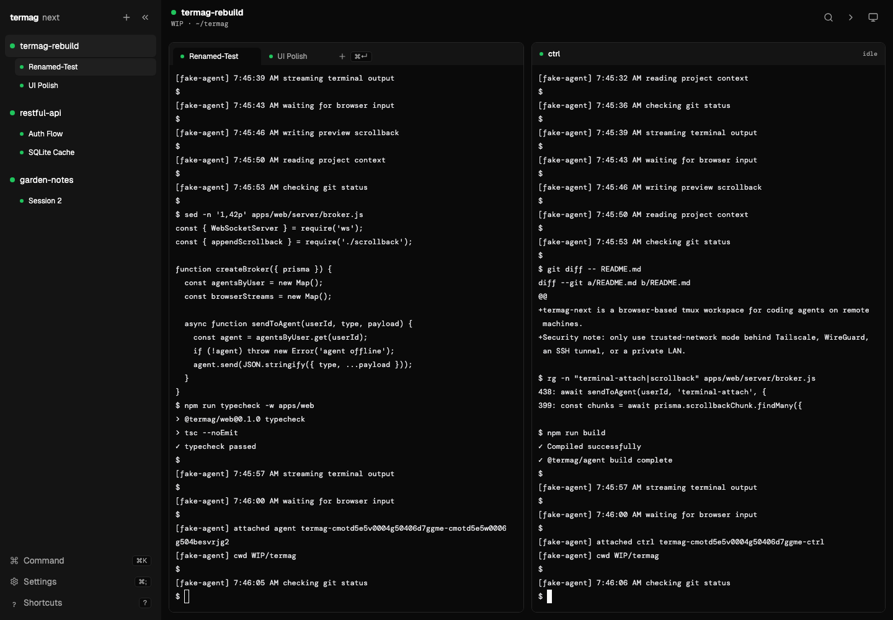

# Terminalz

Terminalz is a lightweight terminal multiplexer that streams terminals from multiple machines to one
web browser. A low-footprint Rust agent on each computer makes its local sessions available through an
outbound encrypted connection—no inbound machine port is required.

Terminalz is heavily inspired by [Termag](https://github.com/psecor/termag) and
[Herdr](https://github.com/herdrdev/herdr).

If Herdr is running, Terminalz mirrors its sessions, spaces, tabs, panes, split layout, ordering,
statuses, and dot/symbol iconography. Herdr stays independent and authoritative. Without Herdr, local
tmux sessions still appear and new sessions can be created inside allowlisted directories.



## What it does

- Connect any number of uniquely named machines to one web account and switch between all of them in
  one compact sidebar.
- Mirror machine → Herdr session → space → tab organization, revealing pane rows only for actual
  multi-pane tabs.
- Stream exact terminal bytes bidirectionally. The latest terminal focus, click, or keystroke owns the
  writer/resize lease; a later interaction from another browser takes it back.
- Keep local terminals awake on macOS while still allowing display sleep and lock.
- Create, rename, and close runtime objects through typed Herdr/tmux operations—never an arbitrary
  remote shell-command channel.

On mobile and constrained networks, Terminalz keeps visible output exact while batching small frames,
compressing WebSockets, requesting smaller reconnect checkpoints, applying compact inventory patches,
and pausing hidden viewers. Phone xterm scrollback is capped at 500 lines; desktop is 2,000.

A lightweight [SwiftUI iPhone and iPad client](apps/ios/README.md) provides native dark
navigation and settings with the existing terminal renderer. This first version
connects to HTTPS password/trusted-network servers or directly to Herdr over SSH,
and requires building with Xcode.

## Architecture

```text
Browsers ── HTTPS/WSS ──> Terminalz web (Next.js custom server + SQLite)
                              ▲
                              │ outbound authenticated WSS
                 ┌────────────┼────────────┐
             terminalz     terminalz    terminalz
             laptop        workstation  server
             ├─ Herdr      ├─ Herdr     ├─ tmux
             └─ tmux       └─ tmux      └─ allowlisted roots
```

SQLite stores users, hashed machine tokens, bootstrap codes, and one latest normalized inventory
snapshot per machine. Terminal output and replay checkpoints remain memory-only and bounded.

## Recommended installation

The web control plane and native machine agent are distributed separately but share one version tag:

- Web: multi-architecture `ghcr.io/yeutterg/terminalz` image with Docker Compose.
- Agent/CLI: `terminalz` native binary through Homebrew or GitHub Releases.

The agent is intentionally not containerized: it needs the current user's Herdr socket, tmux socket,
filesystem policy, git credentials, and macOS power controls.

### 1. Run the web control plane

Download `compose.yml` and `terminalz.env.example` from a release, then:

```bash
cp terminalz.env.example .env
openssl rand -hex 32 # put this value in NEXTAUTH_SECRET
docker compose --env-file .env up -d
```

Or from a checkout:

```bash
git clone https://github.com/yeutterg/terminalz.git
cd terminalz
cp infra/.env.example infra/.env
docker compose --env-file infra/.env -f infra/docker-compose.yml up -d
```

For private Tailscale/WireGuard/LAN use, set:

```env
TERMINALZ_HOST=terminalz.tailnet
NEXTAUTH_URL=https://terminalz.tailnet
NEXTAUTH_SECRET=<random value>
TERMINALZ_TRUSTED_NETWORK=true
TERMINALZ_PASSWORD=<long random value>
```

For a public hostname, leave `TERMINALZ_TRUSTED_NETWORK=false`, configure Google OAuth, and set
`TERMINALZ_ALLOWED_EMAIL`. The callback is
`https://terminalz.example.com/api/auth/callback/google`.

To build the image locally instead of pulling GHCR:

```bash
docker compose --env-file infra/.env \
  -f infra/docker-compose.yml -f infra/docker-compose.build.yml up -d --build
```

### 2. Install the agent on every machine

Homebrew (recommended on macOS and Linux):

```bash
brew install yeutterg/tap/terminalz
```

GitHub Release fallback:

```bash
curl -fsSL https://github.com/yeutterg/terminalz/releases/latest/download/install-agent.sh | sh
```

In the web UI, choose **Machines → Bootstrap machine**, then run its one-use command on the target:

```bash
terminalz bootstrap https://terminalz.example.com/api/bootstrap/claim/...
brew services start terminalz # macOS/Homebrew Linux
```

Manual configuration uses `~/.terminalz/config.json` or canonical environment variables:

```bash
export TERMINALZ_URL=wss://terminalz.example.com/api/ws/agent
export TERMINALZ_AGENT_TOKEN=tmag_...
export TERMINALZ_AGENT_ROOTS='{"projects":"~/Projects"}'
terminalz
```

Existing `~/.termag/config.json` and `TERMAG_*` variables remain readable during migration. New writes
go to `~/.terminalz/config.json`. Plain `ws://` is accepted only for exact loopback hosts.

Browser file drops are copied to `.terminalz-uploads` under the selected terminal's working directory
on its owning machine. Terminalz bracketed-pastes that target-local path after confirmed delivery so
compatible coding-agent TUIs create a real attachment, and removes staged uploads after 24 hours.
Hermes tabs running in same-named Docker containers use an existing policy-allowed writable bind
mount, so Hermes receives a container-local path without a privileged copy operation.

Useful commands:

```bash
terminalz list
terminalz attach laptop:my-space
terminalz config show
terminalz config set roots '{"projects":"~/Projects","services":"~/Services"}'
```

## Local development

```bash
npm ci
cp .env.example apps/web/.env.local
npm run db:migrate
npm run dev
```

Run the native agent in another terminal:

```bash
TERMINALZ_URL=ws://localhost:3000/api/ws/agent \
TERMINALZ_AGENT_TOKEN=tmag_... \
TERMINALZ_AGENT_ROOTS='{"local":"~/Projects"}' \
cargo run --manifest-path apps/agent-rs/Cargo.toml
```

The production web server is much lighter than the development compiler. `npm start` uses a 192 MiB
V8 old-space ceiling; the Rust release agent targets less than 20 MiB RSS and a binary below 15 MiB.

## Verification

```bash
npm run typecheck
npm run lint
npm test -- --runInBand
npm run build

cd apps/agent-rs
cargo fmt --check
cargo clippy --locked --all-targets -- -D warnings
cargo test --locked
cargo build --release --locked
```

## Security notes

- Raw machine tokens are shown once and stored hashed in SQLite.
- Machine names are unique per account, so multiple connected agents cannot silently replace one
  another; reconnecting the same named machine intentionally replaces only its old socket.
- Directory, git, runtime, and power operations are allowlisted and validated on the local agent.
- The service worker never caches API, auth, WebSocket, navigation, or terminal responses.
- Terminal output is not persisted or sent to observability services.
- Trusted-network mode is only as private as the network in front of it. Use OAuth on the open
  internet.
