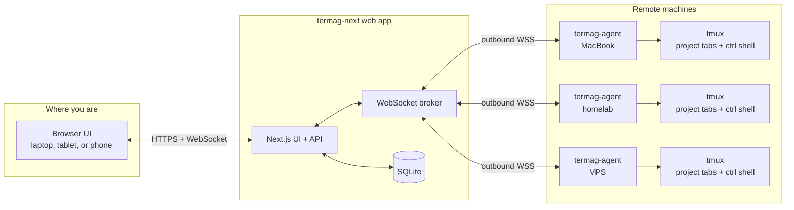

# termag-next

termag-next is a browser-based tmux workspace for coding agents on remote machines.

It is a Next.js fork and rebuild of the original [termag](https://github.com/yeutterg/termag) project. The idea is simple: run one web app somewhere reachable, run a small outbound agent on each machine that has projects, then use one browser to open the tmux sessions from all of those machines.

That browser can be on your laptop, a tablet, or a phone on a cellular connection. Your real work still happens inside tmux on the remote device, but the UI follows you.


## How It Works



The agent always dials out to the web app. You do not need to expose tmux, SSH, or a laptop port to the internet.

## Components

- `apps/web`: the Next.js app. It includes the browser UI, route handlers, WebSocket broker, Prisma, and SQLite database.
- `apps/agent`: the small daemon that runs beside tmux on each remote device and bridges terminal I/O back to the browser.
- `infra`: Docker Compose and Caddy files for running the web app on a small VPS.

The user-facing shape is:

- Device: a machine running `termag-agent`, represented by a named root like `WIP` or `homelab`.
- Project: a folder under one of those named roots.
- Tab: one tmux-backed coding-agent session inside a project.
- Ctrl shell: a regular project shell for git, tests, and quick commands.

## Quick Setup

### 1. Run The Web App

Docker Compose is the preferred route for the web app.

Security note: the default trusted-network mode is effectively unauthenticated. Only use it when access is already restricted by something like Tailscale, WireGuard, an SSH tunnel, or a private LAN. Do not expose an unauthenticated termag-next instance on the public internet.

```bash
git clone https://github.com/yeutterg/termag-next.git
cd termag-next
```

Create `infra/.env`:

```bash
TERMAG_HOST=localhost
NEXTAUTH_URL=http://localhost
NEXTAUTH_SECRET=replace-with-output-of-openssl-rand-hex-32
TERMAG_ROOTS={"WIP":"~/WIP"}
```

Start the stack:

```bash
docker compose --env-file infra/.env -f infra/docker-compose.yml up -d --build
```

Open `http://localhost`. For a VPS, set `TERMAG_HOST` and `NEXTAUTH_URL` to your real hostname, for example `termag.example.com` and `https://termag.example.com`. If that hostname is public, configure OAuth before relying on it.

### Web App Security

termag-next has three browser access modes. Agent connections are separate and always require a bearer token created in the web UI.

The default is trusted-network mode. There is no login screen; anyone who can reach the web app can use it. This is only appropriate behind a private access layer:

```bash
TERMAG_HOST=localhost
NEXTAUTH_URL=http://localhost
```

For a thin shared-password gate on top of trusted-network mode, add:

```bash
TERMAG_PASSWORD=pick-a-long-random-string
```

This is useful for private deployments where you want a second check, but it is still a shared password. It is not full public-internet auth.

For a public hostname, turn trusted-network mode off and use Google OAuth with a single allowed email:

```bash
TERMAG_TRUSTED_NETWORK=false
NEXTAUTH_URL=https://termag.example.com
NEXTAUTH_SECRET=replace-with-output-of-openssl-rand-hex-32
GOOGLE_CLIENT_ID=...
GOOGLE_CLIENT_SECRET=...
TERMAG_ALLOWED_EMAIL=you@example.com
```

Put these variables in `infra/.env` for Docker Compose, or in `apps/web/.env.local` for local development.

### 2. Create An Agent Token

Open Settings in the web UI and create an agent token. The raw token is only shown once.

### 3. Install An Agent On Each Device

The agent needs Node.js and tmux. Homebrew is preferred on macOS:

```bash
brew install yeutterg/tap/termag-agent
```

npm works anywhere Node.js and tmux are available:

```bash
npm install -g @yeutterg/agent
```

Run the agent:

```bash
export TERMAG_URL=wss://termag.example.com/api/ws/agent
export TERMAG_AGENT_TOKEN=tmag_...
export TERMAG_AGENT_ROOTS='{"WIP":"~/WIP"}'

termag-agent
```

For local Docker testing, use:

```bash
export TERMAG_URL=ws://localhost/api/ws/agent
```

Add more devices by installing the agent on each one and giving each device named roots that make sense there.

## Local Development

For working on termag-next itself:

```bash
npm install
cp .env.example apps/web/.env.local
npm run db:generate
npm run db:migrate
npm run dev
```

Run a local agent in another shell:

```bash
TERMAG_URL=ws://localhost:3000/api/ws/agent \
TERMAG_AGENT_TOKEN=tmag_... \
TERMAG_AGENT_ROOTS='{"WIP":"~/WIP"}' \
npm run agent
```

Preview the UI without tmux:

```bash
DATABASE_URL='file:./dev.db' npm run preview:seed -w apps/web
npm run dev
```

Then in another shell:

```bash
TERMAG_URL='ws://localhost:3000/api/ws/agent' \
TERMAG_AGENT_TOKEN='tmag_preview_local_agent_token' \
npm run fake -w apps/agent
```

## Useful Commands

```bash
npm run typecheck
npm run build
npm run dev
npm run agent
```
